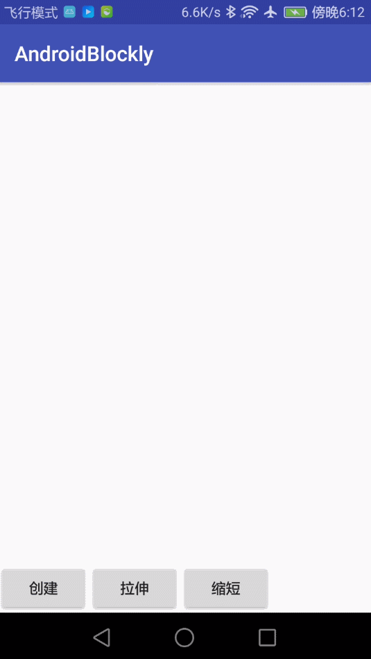

# SVG图像解析器

## 描述

* 本案例中提供了一个svg图像解析工具
* 使用本工具可以解析矢量图象将其转换为path
* 使用本工具可以对矢量图进行局部更新，局部变形等效果

## 使用

* 添加svgparser依赖

  **步骤 1.**将JitPack存储库添加到构建文件中 

  将其添加到存储库末尾的根build.gradle中： 

  ```
  	allprojects {
  		repositories {
  			...
  			maven { url 'https://jitpack.io' }
  		}
  	}
  ```

  **步骤 2.** 添加依赖项 

  ```
  	dependencies {
  	        implementation 'com.github.CNHubin:SvgParser:1.0.1'
  	}
  ```

## 文档

* 创建一个类继承Svg，自行扩展svg的功能

  ```
  public class SvgBlockFor extends Svg{
      
  }
  ```

* 构造中调用parserPath()解析图像

  ```
  public SvgBlockFor(InputStream inputStream) {
      super(inputStream);
      parserPath();//开始解析
  }
  ```

* 解析后的数据

  >```
  >mNodeList	:通过Don解析出来的path节点集合
  >totalRect	:该图像的最大外接矩形
  >mPathList	:解析后的 Path集合
  >mAttrsList	:通过Svg解析器解析出来的所有属性
  >```

* 解析后的数据封装在SvgInfo中

  ```
  public class SvgInfo {
  
      /**
       * 通过Don解析出来的path节点集合
       */
      public NodeList mNodeList;
      /**
       * 该图像的最大外接矩形
       */
      public RectF totalRect;
      /**
       * 解析后的 Path集合
       */
      public List<Path> mPathList = new ArrayList<>();
  
      /**
       * 通过Svg解析器解析出来的所有属性
       */
      public List<SvgPathParser.PathDataNode[]> mAttrsList = new ArrayList<>();
  
  }
  ```


## 案例

demo中提供了一个简单案例，自定义View绘制矢量图并且控制其拉伸和缩小

